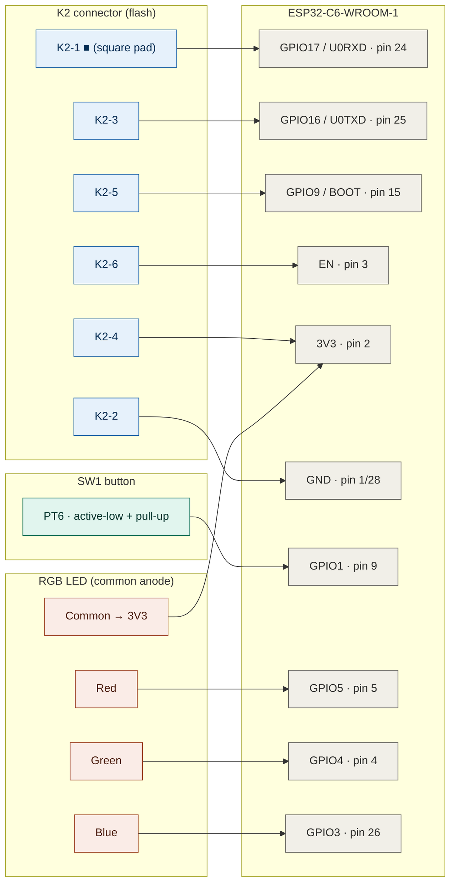

[](esphome-proxy.fr.md) [](esphome-proxy.en.md)

# Recycling the Flipr WiFi gateway into an ESPHome Bluetooth proxy

A reverse-engineering and reflashing guide for the **Flipr WiFi gateway ("FLIPR GATEWAY Rev02")**, turning it into an **ESPHome Bluetooth proxy** to complement the [`ha-flipr-local`](https://github.com/Adrien40/ha-flipr-local) integration.

The goal: instead of throwing away the now-useless gateway and buying a dedicated ESP32 as a Bluetooth proxy, **reuse the existing hardware**. The gateway is built around an ESP32-C6, perfectly suited to act as a `bluetooth_proxy` and relay the Flipr AnalysR probe's BLE traffic to Home Assistant.

> **Warning.** This guide involves opening the hardware, soldering/probing test points and replacing the original firmware. You do this at your own risk. You must back up the original firmware (see below) before any flash.

---

## Table of contents

1. [Hardware involved](#hardware-involved)
2. [What you need](#what-you-need)
3. [Pitfalls to know about (read first)](#pitfalls-to-know-about)
4. [K2 programming connector pinout](#k2-connector-pinout)
5. [GPIO map](#gpio-map)
6. [Preparing the USB-TTL adapter under WSL2](#preparing-the-usb-ttl-adapter-under-wsl2)
7. [Compiling the ESPHome firmware](#compiling-the-esphome-firmware)
8. [Flashing procedure](#flashing-procedure)
9. [Finding the Flipr probe's MAC address](#finding-the-flipr-probes-mac-address)
10. [Full ESPHome configuration](#esphome-configuration)
11. [Home Assistant automation (button)](#home-assistant-automation)
12. [Credits](#credits)

---

## Hardware involved

- **Gateway**: board silk-screened "FLIPR GATEWAY Rev02"
- **SoC**: ESP32-C6-WROOM-1 (4 MB of flash on the tested unit)
- **Useful peripherals**: USB-C (power), SW1 pushbutton, RGB LED
- **Probe**: Flipr AnalysR 3 (values are decoded by `ha-flipr-local`, not by the gateway)

### Opening the case

The case is very light (few components inside). Four small Phillips screws are **hidden under the rubber feet** in the four corners, underneath. On the tested unit the screw heads were fairly chewed up (intentionally?), but a clean, well-fitting screwdriver with firm pressure backs them out without too much trouble.

Inside is a minimalist board: an **ESP32-C6** in the center, a 3.3 V regulator to its right, the SW1 pushbutton near the USB-C, an **RGB LED** on the right (under an unpopulated `IC2` footprint), and a large **K2** footprint: the UART programming connector.

<p align="center">
  
</p>

### Connections traced with a multimeter



From there it is almost straightforward: solder a 2x3p header onto K2 and off you go.

---

## What you need

- A **3.3 V USB-TTL adapter** (CH343, CP2102, CH340… with the level selector **set to 3V3**). The CH343G-based [Waveshare USB-to-TTL (B)](https://amzn.eu/d/05ITAASp) works well.
- `esptool` (v5.x recommended; I used 5.3.0 for this guide).
- ESPHome (via Docker, the Home Assistant add-on, or the CLI).
- A few thin Dupont-style wires and, ideally, a 2.54 mm-pitch 2x3p connector for K2, though plain wires also do the job.

> **WSL2 / Windows**: an extra step is required to expose the USB-TTL adapter to WSL2 — see [Preparing the USB-TTL adapter under WSL2](#preparing-the-usb-ttl-adapter-under-wsl2).

---

## Pitfalls to know about

These points are **counter-intuitive** and will cost hours to anyone who does not anticipate them. Read them before you start.

### 1. USB-C is power only

The USB-C data lines (D+/D-) are **not wired** to the SoC on this board. The ESP32-C6's native USB Serial/JTAG is therefore **unusable**: you cannot flash over USB-C. Flashing must be done **over UART**, via the **K2** test connector, hence the need for a USB-TTL adapter.

### 2. The button is on GPIO1, NOT GPIO9

Intuitively you'd assume the button sits on the BOOT pin (GPIO9). **That's wrong.** On this board:

- **GPIO9 = BOOT only** (exposed on K2, used for serial flashing)
- **SW1 button = GPIO1** (also reachable on test pad PT6)

The button is **active-low with a pull-up** (3.3 V at rest, 0 V when pressed).

### 3. The RGB LED is on strapping pins → boot loop

The RGB LED (common anode) is wired to **GPIO5 (Red), GPIO4 (Green), GPIO3 (Blue)**. But **GPIO4 and GPIO5 are strapping pins** on the ESP32-C6.

Without precautions, the firmware **goes into a boot loop** (resets in a loop, with the `rst:0xf (LP_BOD_SYS)` symptom that misleadingly looks like a power problem). The fix:

- `ignore_strapping_warning: true` on GPIO4 and GPIO5
- `restore_mode: ALWAYS_OFF` on the light (prevents the LED from initializing in an active state at boot)

---

## K2 connector pinout

The **K2** connector is a 6-point production programming header (2 rows of 3). The **square silk-screened pad = pin 1** (standard orientation reference).

```text
  K2 (top view, square pad = pin 1)

  Row 1:  [■ K2-1]   [ K2-2 ]   [ K2-3 ]
  Row 2:  [ K2-4 ]   [ K2-5 ]   [ K2-6 ]
```

| Position         | Signal         | Module pin | Role                           |
|------------------|----------------|------------|--------------------------------|
| **K2-1** (square)| U0RXD / GPIO17 | 24         | ESP RX (← adapter TXD)         |
| **K2-2**         | GND            | 1/28       | Common ground                  |
| **K2-3**         | U0TXD / GPIO16 | 25         | ESP TX (→ adapter RXD)         |
| **K2-4**         | 3V3            | 2          | 3.3 V power                    |
| **K2-5**         | GPIO9 / BOOT   | 15         | BOOT (to GND for download mode)|
| **K2-6**         | EN             | 3          | Reset                          |

> Test pad **PT3** is also tied to GND, and **PT6** to the button (GPIO1) — handy as alternative access points.

---

## GPIO map

Full summary of the useful GPIOs, verified with a multimeter:

| Function              | GPIO    | Notes                                              |
|-----------------------|---------|----------------------------------------------------|
| UART0 TX (flash)      | GPIO16  | K2-3                                               |
| UART0 RX (flash)      | GPIO17  | K2-1                                               |
| BOOT                  | GPIO9   | K2-5, strapping — flashing only                    |
| EN / Reset            | EN      | K2-6                                               |
| SW1 button            | GPIO1   | PT6, active-low + pull-up                          |
| Red LED               | GPIO5   | strapping ⚠                                        |
| Green LED             | GPIO4   | strapping ⚠                                        |
| Blue LED              | GPIO3   | —                                                  |
| LED common            | 3V3     | common anode (cathodes driven, inverted logic)     |

---

## Preparing the USB-TTL adapter under WSL2

*This section only concerns **Windows + WSL2** users. On native Linux or macOS the adapter shows up directly (typically `/dev/ttyUSB0` or `/dev/ttyACM0`) — skip to the next section.*

WSL2 does not see Windows USB devices by default. You have to attach them with [`usbipd-win`](https://github.com/dorssel/usbipd-win).

### Installation (one time)

In **PowerShell as administrator**:

```powershell
winget install --exact dorssel.usbipd-win
```

Close and reopen PowerShell so the `usbipd` command is recognized.

On the WSL side (Ubuntu), install the USB names helper (optional but handy for `lsusb`):

```bash
sudo apt install hwdata
```

### Each time you plug in the adapter

Keep **a WSL terminal open** (this keeps the VM alive). Plug in the adapter, then in admin PowerShell:

```powershell
usbipd list
```

Find your adapter in the list (e.g. `USB-Enhanced-SERIAL CH343`) and note its **BUSID** (format `X-Y`, e.g. `2-10`). Then:

```powershell
usbipd bind --busid 2-10          # once per device (persistent)
usbipd attach --wsl --busid 2-10  # redo after each replug or wsl --shutdown
```

Check on the WSL side:

```bash
lsusb                              # should list QinHeng Electronics (CH343)
ls /dev/ttyACM* /dev/ttyUSB*       # the port shows up, often /dev/ttyACM0
```

The CH343 usually comes up as `/dev/ttyACM0` (handled by the `cdc_acm` driver built into recent WSL kernels). That's the path to pass to `esptool` via `--port`.

> If you customize the WSL network to *bridge* mode in `.wslconfig`, `usbipd` will not work. Stay in *mirrored* mode (or default). And remember: after each `wsl --shutdown`, you must redo the `usbipd attach`.

---

## Compiling the ESPHome firmware

You can compile with any ESPHome method (Home Assistant add-on, CLI). The example below uses **Docker**, which is convenient and reproducible.

### 1. Prepare the folder

Put the `flipr-proxy.yaml` file (see [ESPHome configuration](#esphome-configuration)) in a working folder. Fill in your values: WiFi SSID/password, OTA password, and a **valid API key** generated with:

```bash
openssl rand -base64 32
```

(Paste the result into the `api: → encryption: → key:` field.)

### 2. Compile

```bash
cd ~/flipr-proxy        # your folder containing flipr-proxy.yaml
docker run --rm -v "${PWD}":/config ghcr.io/esphome/esphome compile flipr-proxy.yaml
```

> The very first compile downloads ESP-IDF and the RISC-V toolchain (10–15 min). Subsequent ones are cached and much faster.

### 3. Get the binary to flash

The **`firmware.factory.bin`** file (full image: bootloader + partition table + application, to be written at address `0x0`) is in the build tree:

```bash
find .esphome/build -name "*.factory.bin"
# typically: .esphome/build/flipr-proxy/.pioenvs/flipr-proxy/firmware.factory.bin

# copy it within reach for flashing
cp .esphome/build/flipr-proxy/.pioenvs/flipr-proxy/firmware.factory.bin ~/flipr-proxy/
```

> **Important for the ESP32-C6**: the config **must** use the `esp-idf` framework (the C6 is not supported by the Arduino framework in ESPHome). This is already the case in the provided YAML. A recent ESPHome version is required (C6 support stabilized since 2025.6.0).

---

## Flashing procedure

### 1. Wiring (null-modem: cross TX and RX)

Adapter **set to 3V3**. Power from **a single source** (either the adapter's 3V3 on K2-4, or the board's USB-C, but never both).

```text
USB-TTL adapter            K2 (Flipr board)
──────────────────         ────────────────
TXD                   →    K2-1  (RXD0 / GPIO17)
RXD                   →    K2-3  (TXD0 / GPIO16)
GND                   →    K2-2  (GND)
VCC (3V3, optional)   →    K2-4  (3V3) ← only if powering from the adapter
```

Keep two flying leads accessible: one on **K2-5 (BOOT)** and one on **K2-6 (EN)**, to touch them to GND.

> If "No serial data received": it's almost always **TX/RX swapped**. Swap the two wires, it's harmless.

### 2. Entering download mode (manual)

1. Hold **K2-5 (BOOT)** tied to GND.
2. Briefly touch **K2-6 (EN)** to GND, then release EN.
3. Release BOOT.

### 3. Check communication

```bash
esptool --port /dev/ttyACM0 --before no-reset --after no-reset chip-id
esptool --port /dev/ttyACM0 --before no-reset --after no-reset flash-id
```

`flash-id` confirms the flash size (4 MB on the tested unit → `flash_size: 4MB` in the YAML).

### 4. Back up the original firmware

```bash
esptool --port /dev/ttyACM0 --before no-reset --after no-reset read-flash 0x0 0x400000 flipr_original_firmware.bin
sha256sum flipr_original_firmware.bin   # note the hash and keep a copy elsewhere for safety
```

This is your **only way back** to the factory firmware. Do not skip this step.

### 5. Flash ESPHome

```bash
esptool --port /dev/ttyACM0 --before no-reset --after hard-reset write-flash 0x0 firmware.factory.bin
```

At the end, `--after hard-reset` reboots the ESP onto the new firmware. Check the boot via the serial logs (leave the adapter wired):

```bash
docker run --rm -v "${PWD}":/config --device=/dev/ttyACM0 ghcr.io/esphome/esphome logs flipr-proxy.yaml --device /dev/ttyACM0
```

> To see ESPHome's **application** logs on this serial port, `logger` must be set to `hardware_uart: UART0` (already the case in the provided YAML). This is necessary because the native USB Serial/JTAG (GPIO12/13) is not accessible on this board.

### 6. Subsequent updates: WiFi OTA

Once the ESP is connected to WiFi, **the serial cable is no longer needed**. All updates go over OTA:

```bash
docker run --rm -v "${PWD}":/config ghcr.io/esphome/esphome run flipr-proxy.yaml --device <Flipr-Proxy-IP>
```

> In case of a boot loop after a bad OTA flash, ESPHome has a **safe mode**: after 10 failed boots it starts in safe mode with only WiFi/OTA active, which lets you re-flash a fixed version without getting the cable out again.

---

## Finding the Flipr probe's MAC address

The ESPHome config needs your **probe's BLE MAC address** (for the `ble_presence` detection). Here are three methods, from simplest to most technical.

> **Don't confuse** the probe's MAC with the ESP's. In the logs, the `esp32_ble: → MAC address:` line is the **gateway's own BLE**, not the probe. The probe shows up in the **BLE client** or **tracker** lines.

### Method 1 — via the proxy logs (recommended)

Once the proxy is flashed and running, start the logs and watch the BLE connections. When `ha-flipr-local` queries the probe, you'll see an `esp32_ble_client` connection line with its address:

```text
[I][esp32_ble_client:126]: [0] [EE:5E:72:B5:0D:74] 0x01 Connecting
[D][esp32_ble_client:212]: [0] [EE:5E:72:B5:0D:74] ESP_GATTC_CONNECT_EVT
```

Here, `EE:5E:72:B5:0D:74` is the probe's address. (Yours will obviously be different.)

### Method 2 — via a BLE scanning app

With **nRF Connect** (Android/iOS) or an equivalent tool, scan near the probe. Find the device named "Flipr…" or carrying a CTAC identifier, and read off its MAC address.

### Method 3 — via Home Assistant

If the `ha-flipr-local` integration is already configured, the probe's address may appear in the device information (Settings → Devices & Services → Flipr device) or as an attribute of one of its entities (Developer Tools → States).

### Once you have the MAC

Put it into the ESPHome config, on the `mac_address:` line of the `ble_presence` `binary_sensor`:

```yaml
binary_sensor:
  - platform: ble_presence
    mac_address: EE:5E:72:B5:0D:74   # ← replace with YOUR probe's MAC
    ...
```

---

## ESPHome configuration

Complete, self-contained config. Replace the bracketed values. The LED carries an **autonomous status state machine**: the gateway shows its state without depending on Home Assistant.

### Color scheme

| Color                  | State                                          | Priority |
|------------------------|------------------------------------------------|----------|
| 🔴 Solid red           | WiFi disconnected                              | 1 (max)  |
| 🟠 Solid orange        | WiFi OK, Home Assistant API unreachable        | 2        |
| 🟣 Solid violet        | Probe not heard for > 150 min                  | 3        |
| 🟢 Dimmed green        | All nominal                                    | 4 (rest) |
| 🔵 Short blue pulse    | Heartbeat (every 5 min when nominal)           | —        |

Button: **short press** = diagnostic flash (+ Flipr refresh via HA); **long press (3 s)** = toggle night mode (LED off, persistent across reboot).

> Remember to replace the MAC address `EE:5E:72:B5:0D:74` with **your** Flipr probe's (visible in the proxy logs or in Home Assistant). The 150-min "violet" threshold assumes a 60-min polling interval on the `ha-flipr-local` side; adjust it if you changed that frequency.

```yaml
esphome:
  name: flipr-proxy
  friendly_name: Flipr BLE Proxy
  on_boot:
    - priority: -100
      then:
        - script.execute: update_led

esp32:
  board: esp32-c6-devkitc-1
  variant: esp32c6
  flash_size: 4MB
  framework:
    type: esp-idf

logger:
  hardware_uart: UART0

api:
  encryption:
    key: "[YOUR_BASE64_API_KEY]" # openssl rand -base64 32
  on_client_connected:
    - lambda: 'id(ha_connected) = true;'
    - script.execute: update_led
  on_client_disconnected:
    - lambda: 'id(ha_connected) = false;'
    - script.execute: update_led

ota:
  - platform: esphome
    password: "[YOUR_OTA_PASSWORD]"

wifi:
  ssid: "[YOUR_SSID]"
  password: "[YOUR_WIFI_PASSWORD]"
  ap:
    ssid: "Flipr-Proxy Fallback"
    password: "[YOUR_AP_PASSWORD]"
  on_connect:
    - lambda: 'id(wifi_connected) = true;'
    - script.execute: update_led
  on_disconnect:
    - lambda: 'id(wifi_connected) = false;'
    - script.execute: update_led

captive_portal:

globals:
  - id: wifi_connected
    type: bool
    restore_value: no
    initial_value: 'false'
  - id: ha_connected
    type: bool
    restore_value: no
    initial_value: 'false'
  - id: last_sonde_seen # timestamp (millis) of the last probe contact
    type: uint32_t
    restore_value: no
    initial_value: '0'
  - id: led_off_mode # night mode (LED off), persistent
    type: bool
    restore_value: yes
    initial_value: 'false'

# ---- BLE ----
esp32_ble_tracker:
  scan_parameters:
    interval: 1100ms
    window: 1100ms
    active: true

bluetooth_proxy:
  active: true

binary_sensor:
  - platform: ble_presence
    mac_address: EE:5E:72:B5:0D:74 # YOUR Flipr probe's MAC
    name: "Flipr Sonde Présente"
    id: sonde_presence
    on_state:
      then:
        - lambda: 'id(last_sonde_seen) = millis();'
        - script.execute: update_led

  - platform: gpio
    name: "Flipr Proxy Button"
    pin:
      number: GPIO1
      mode:
        input: true
        pullup: true
      inverted: true
    id: status_button
    on_click:
      min_length: 50ms
      max_length: 2000ms
      then:
        - script.execute: diag_flash
    on_press:
      then:
        - delay: 3s
        - if:
            condition:
              binary_sensor.is_on: status_button
            then:
              - lambda: 'id(led_off_mode) = !id(led_off_mode);'
              - script.execute: update_led

output:
  - platform: ledc
    pin: { number: GPIO5, inverted: true, ignore_strapping_warning: true }
    id: led_r
  - platform: ledc
    pin: { number: GPIO4, inverted: true, ignore_strapping_warning: true }
    id: led_g
  - platform: ledc
    pin: { number: GPIO3, inverted: true }
    id: led_b

light:
  - platform: rgb
    name: "Flipr Proxy LED"
    red: led_r
    green: led_g
    blue: led_b
    id: status_led
    restore_mode: ALWAYS_OFF # mandatory: avoids the boot loop on strapping pins
    default_transition_length: 300ms

script:
  - id: update_led
    mode: restart
    then:
      - lambda: |-
          // Night mode: LED off
          if (id(led_off_mode)) {
            auto call = id(status_led).turn_off();
            call.perform();
            return;
          }
          float r=0, g=0, b=0, bright=1.0;
          bool sonde_ok = (id(last_sonde_seen) != 0) &&
                          ((millis() - id(last_sonde_seen)) < 9000000UL); // 150 min

          if (!id(wifi_connected)) {
            r=1.0; g=0;   b=0;   bright=1.0;   // RED: WiFi disconnected
          } else if (!id(ha_connected)) {
            r=1.0; g=0.4; b=0;   bright=1.0;   // ORANGE: HA unreachable
          } else if (!sonde_ok) {
            r=0.5; g=0;   b=1.0; bright=1.0;   // VIOLET: probe lost
          } else {
            r=0;   g=1.0; b=0;   bright=0.5;   // Dimmed GREEN: all nominal
          }
          auto call = id(status_led).turn_on();
          call.set_rgb(r, g, b);
          call.set_brightness(bright);
          call.perform();

  - id: heartbeat_pulse
    mode: restart
    then:
      - if:
          condition:
            and:
              - lambda: 'return id(wifi_connected) && id(ha_connected) && !id(led_off_mode);'
              - lambda: |-
                  return (id(last_sonde_seen) != 0) &&
                         ((millis() - id(last_sonde_seen)) < 9000000UL);
          then:
            - light.turn_on:
                id: status_led
                red: 0%
                green: 20%
                blue: 100%
                brightness: 80%
                transition_length: 400ms
            - delay: 600ms
            - script.execute: update_led

  - id: diag_flash
    then:
      - light.turn_on:
          id: status_led
          brightness: 100%
      - delay: 3s
      - script.execute: update_led

interval:
  - interval: 5min
    then:
      - script.execute: heartbeat_pulse
```

> **Debug note.** Running `esphome logs` over the network occupies the ESP's API connection: Home Assistant is then temporarily evicted and the LED turns **orange**. This is normal; reload the ESPHome integration (or wait for the reconnection) to return to green.

---

## Home Assistant automation

Forces an immediate probe read when the proxy button is pressed (outside the normal polling cycle). Adapt the entity names to your install (Developer Tools → States, filter "flipr").

```yaml
alias: "Flipr - Refresh on proxy button"
description: "Forces a Flipr probe read when the proxy button is pressed"
triggers:
  - trigger: state
    entity_id: binary_sensor.flipr_proxy_button
    to: "on"
conditions: []
actions:
  - action: homeassistant.update_entity
    target:
      entity_id: sensor.flipr_xxxx_ph # a single Flipr entity is enough to refresh the coordinator
mode: single
```

> `homeassistant.update_entity` triggers an immediate GATT re-read of the probe by `ha-flipr-local`. This updates the probe's last known value; it does not force the probe itself to take a new physical measurement.

---

## Credits

- Home Assistant integration: [`ha-flipr-local`](https://github.com/Adrien40/ha-flipr-local) by **@Adrien40**.
- This hardware guide documents recycling the Flipr WiFi gateway into an ESPHome Bluetooth proxy, as a complement to that integration.

---

*Provided for informational purposes only, with no connection to CTAC-TECH / Yotilus / Flipr. Use at your own risk.*
