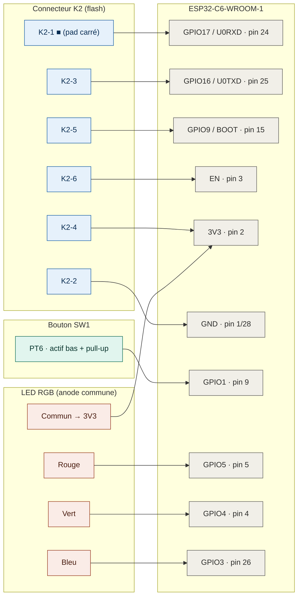

# Recycler la passerelle WiFi Flipr en proxy Bluetooth ESPHome

Guide de reverse engineering et de reflashage de la **passerelle WiFi Flipr (« FLIPR GATEWAY Rev02 »)** pour la transformer en **proxy Bluetooth ESPHome**, en complément de l'intégration [`ha-flipr-local`](https://github.com/Adrien40/ha-flipr-local).

L'objectif : au lieu de jeter la passerelle devenue inutile et d'acheter un ESP32 dédié comme proxy Bluetooth, on **réutilise le matériel existant**. La passerelle embarque un ESP32-C6, parfaitement adapté au rôle de `bluetooth_proxy` pour relayer le BLE de la sonde Flipr AnalysR jusqu'à Home Assistant.

Vous partez plutôt d'un **ESP32 neuf** (sans recycler la passerelle) ? Voir [`esphome-proxy-esp32.md`](esphome-proxy-esp32.md) pour une config de référence minimale.

> **Avertissement.** Ce guide implique d'ouvrir le matériel, de souder/sonder des points de test et de remplacer le firmware d'origine. Vous le faites à vos propres risques. Faites impérativement une sauvegarde du firmware d'origine (voir plus bas) avant tout flash.

---

## Sommaire

1. [Matériel concerné](#matériel-concerné)
2. [Ce dont vous avez besoin](#ce-dont-vous-avez-besoin)
3. [Les pièges à connaître (à lire en premier)](#les-pièges-à-connaître)
4. [Brochage du connecteur de programmation K2](#brochage-du-connecteur-k2)
5. [Cartographie des GPIO](#cartographie-des-gpio)
6. [Préparer l'adaptateur USB-TTL sous WSL2](#préparer-ladaptateur-usb-ttl-sous-wsl2)
7. [Compiler le firmware ESPHome](#compiler-le-firmware-esphome)
8. [Procédure de flash](#procédure-de-flash)
9. [Récupérer l'adresse MAC de la sonde Flipr](#récupérer-ladresse-mac-de-la-sonde-flipr)
10. [Configuration ESPHome complète](#configuration-esphome)
11. [Automatisation Home Assistant (bouton)](#automatisation-home-assistant)
12. [Crédits](#crédits)

---

## Matériel concerné

- **Passerelle** : carte sérigraphiée « FLIPR GATEWAY Rev02 »
- **SoC** : ESP32-C6-WROOM-1 (4 MB de flash sur l'exemplaire testé)
- **Périphériques utiles** : USB-C (alimentation), bouton poussoir SW1, LED RGB
- **Sonde** : Flipr AnalysR 3 (les valeurs sont décodées par `ha-flipr-local`, pas par la passerelle)

### Ouverture du boîtier

Le boîtier est très léger (peu de composants à l'intérieur). Quatre petites vis cruciformes sont **cachées sous les patins caoutchouteux** des quatre coins, en dessous. Sur l'exemplaire testé, les têtes de vis étaient assez abîmées (volontairement ?), mais un tournevis propre bien adapté, en appuyant fermement, les sort sans trop de difficulté.

On tombe alors sur une carte minimaliste : un **ESP32-C6** au centre, un régulateur 3,3 V à sa droite, le bouton poussoir SW1 près de l'USB-C, une **LED RGB** à droite (sous un emplacement `IC2` non peuplé), et un large footprint **K2** : le connecteur UART de programmation.

<p align="center">
  
</p>

### Connexions relevées au multimètre



À partir de là, c'est presque tout droit : un header 2x3p soudé sur K2 et c'est parti.

---

## Ce dont vous avez besoin

- Un **adaptateur USB-TTL 3,3 V** (CH343, CP2102, CH340… avec sélecteur de niveau **réglé sur 3V3**). Le modèle [Waveshare USB-to-TTL (B)](https://amzn.eu/d/05ITAASp) à base de CH343G fonctionne bien.
- `esptool` (v5.x recommandé, j'ai utilisé la 5.3.0 pour ce guide).
- ESPHome (via Docker, l'add-on Home Assistant, ou la CLI).
- Quelques fils fins type Dupont et idéalement un connecteur type 2x3p au pas de 2,54 mm pour le connecteur K2 mais ça peut se faire avec de simples fils.

> **WSL2 / Windows** : une étape supplémentaire est nécessaire pour exposer l'adaptateur USB-TTL à WSL2 - voir [Préparer l'adaptateur USB-TTL sous WSL2](#préparer-ladaptateur-usb-ttl-sous-wsl2).

---

## Les pièges à connaître

Ces points sont **contre-intuitifs** et feront perdre des heures à qui ne les anticipe pas. Lisez-les avant de commencer.

### 1. L'USB-C n'est qu'une alimentation

Les broches data (D+/D-) de l'USB-C **ne sont pas câblées** au SoC sur cette carte. L'USB Serial/JTAG natif de l'ESP32-C6 est donc **inutilisable** : impossible de flasher par l'USB-C. Le flash se fait obligatoirement **par UART**, via le connecteur de test **K2** d'où la nécessité de passer par un adaptateur USB-TTL.

### 2. Le bouton est sur GPIO1, PAS sur GPIO9

Intuitivement on suppose que le bouton est sur le pin BOOT (GPIO9). **C'est faux.** Sur cette carte :

- **GPIO9 = BOOT uniquement** (exposé sur K2, sert au flash série)
- **Bouton SW1 = GPIO1** (également accessible sur le pad de test PT6)

Le bouton est en logique **active-bas avec pull-up** (3,3 V au repos, 0 V pressé).

### 3. La LED RGB est sur des strapping pins → boot loop

La LED RGB (anode commune) est câblée sur **GPIO5 (Rouge), GPIO4 (Vert), GPIO3 (Bleu)**. Or **GPIO4 et GPIO5 sont des strapping pins** de l'ESP32-C6.

Sans précaution, le firmware **part en boot loop** (reset en boucle, symptôme `rst:0xf (LP_BOD_SYS)` qui ressemble trompeusement à un problème d'alimentation). La parade :

- `ignore_strapping_warning: true` sur GPIO4 et GPIO5
- `restore_mode: ALWAYS_OFF` sur la lumière (évite que la LED s'initialise dans un état actif au boot)

### 4. Le scan BLE continu (`window == interval`) fige la coexistence du C6

Le piège le plus vicieux, car différé. Tout fonctionne pendant un jour ou deux (lecture horaire OK), puis `ha-flipr-local` se bloque en `out_of_range` pendant des jours, et seul un redémarrage physique du proxy le débloque, temporairement. Le WiFi du proxy ne tombe jamais (LED verte, passerelle en ligne) : seule la liaison BLE vers la sonde meurt.

Cause : l'ESP32-C6 n'a qu'une seule radio 2,4 GHz, partagée entre WiFi et BLE. Avec `interval` égal à `window` (le `1100ms / 1100ms` d'une version précédente de ce guide), le scanner écoute en continu, 100 % du temps, sans jamais rendre la main. La coexistence WiFi/BLE n'a plus de créneau pour basculer proprement en connexion GATT active, et au bout d'un moment la pile BLE se coince sur une transition scan vers connexion. Elle ne se ré-accroche plus toute seule.

Le réglage : garder une fenêtre longue, mais laisser un petit trou entre deux scans en prenant `window` strictement inférieur à `interval`.

```yaml
esp32_ble_tracker:
  scan_parameters:
    interval: 1100ms
    window: 1000ms   # 100 ms de trou par cycle, rend la main à la coexistence
    active: true
```

Pourquoi une fenêtre aussi longue (1000 ms) et pas les défauts ESPHome (`interval: 320ms / window: 30ms`) : la sonde Flipr émet ses annonces rarement, pour économiser sa pile. Une fenêtre de 30 ms les rate presque toutes, et `ha-flipr-local` tombe alors en `out_of_range` immédiat, sans même tenter la connexion, faute de signal frais. Il faut donc écouter quasi en continu, juste avec le trou de coexistence.

Ceinture et bretelles : ajoutez un bouton `restart` (déjà dans le YAML plus bas) et une automation qui redémarre le proxy si plus aucune analyse ne remonte, voir [Automatisation Home Assistant](#automatisation-home-assistant). Même si la pile BLE se refige un jour, le proxy se relève seul, sans débranchage manuel.

### 5. Home Assistant 2026.7 casse le proxy avec son mode de scan « Auto »

Piège récent et déroutant, car il n'a rien à voir avec le matériel. Après une mise à jour de Home Assistant en 2026.7.x, `ha-flipr-local` tombe en `out_of_range`, le signal Bluetooth passe `unavailable`, et le diagnostic du scanner côté HA affiche `current_mode: null` avec l'avertissement « Bluetooth scanner has gone quiet ». Symptôme trompeur : le proxy va parfaitement bien (WiFi OK, LED verte) et **forwarde bien toutes les annonces BLE** (vérifiable en logs, voir la note de debug de la config), mais Home Assistant ne les consomme plus.

Cause : depuis la 2026.6, le mode de scan par défaut des proxies Bluetooth est **« Auto »** (écoute passive avec fenêtres actives à la demande, piloté par `habluetooth`). En 2026.7.1 (`habluetooth 6.26.2`), ce mode Auto est cassé avec les proxies ESPHome : le scanner distant s'enregistre mais ne route plus les annonces reçues au reste de la pile. Ce n'est pas un souci d'ESPHome ni de firmware (le proxy émet bien ses `BluetoothLERawAdvertisementsResponse`), c'est une régression côté Home Assistant (`habluetooth` a sauté de 6.8.3 à 6.26.2 dans ce patch).

Parade, sans downgrader Home Assistant : forcer le mode de scan du proxy sur **Active**.

1. Paramètres → Appareils et services → intégration **ESPHome** → votre proxy → **Configurer**.
2. **Mode de scan Bluetooth** → **Active** → Valider.
3. **Redémarrer le proxy** (bouton `restart`, ou coupure d'alimentation) pour que le nouveau mode s'applique réellement : le mode Active seul, sans reconnexion de l'ESP, ne suffit pas à débloquer.

Le signal revient (une valeur en dBm au lieu de `unavailable`), la lecture GATT repart, `derniere_analyse` se remet à jour. Gardez le mode sur **Active** tant que Home Assistant n'a pas corrigé le mode Auto.

Ne pas confondre avec le piège n°4 : le n°4 est un gel BLE **côté ESP** (un redémarrage physique le débloque, ça se reproduit après un jour ou deux) ; le n°5 est **côté Home Assistant** (ça casse pile au moment de la mise à jour HA, le proxy est sain, et seul le passage en mode Active corrige).

---

## Brochage du connecteur K2

Le connecteur **K2** est un header de programmation de production à 6 points (2 rangées de 3). Le **pad carré sérigraphié = broche 1** (référence d'orientation standard).

```text
  K2 (vue de dessus, pad carré = broche 1)

  Rangée 1 :  [■ K2-1]   [ K2-2 ]   [ K2-3 ]
  Rangée 2 :  [ K2-4 ]   [ K2-5 ]   [ K2-6 ]
```

| Position | Signal | Pin module | Rôle |
| --- | --- | --- | --- |
| **K2-1** (carré) | U0RXD / GPIO17 | 24 | RX de l'ESP (← TXD adaptateur) |
| **K2-2** | GND | 1/28 | Masse commune |
| **K2-3** | U0TXD / GPIO16 | 25 | TX de l'ESP (→ RXD adaptateur) |
| **K2-4** | 3V3 | 2 | Alimentation 3,3 V |
| **K2-5** | GPIO9 / BOOT | 15 | BOOT (à GND pour download mode) |
| **K2-6** | EN | 3 | Reset |

> Le pad de test **PT3** est également relié à GND, et **PT6** au bouton (GPIO1) - pratiques comme points d'accès alternatifs.

---

## Cartographie des GPIO

Récapitulatif complet des GPIO utiles, vérifiés au multimètre :

| Fonction | GPIO | Notes |
| --- | --- | --- |
| UART0 TX (flash) | GPIO16 | K2-3 |
| UART0 RX (flash) | GPIO17 | K2-1 |
| BOOT | GPIO9 | K2-5, strapping - flash uniquement |
| EN / Reset | EN | K2-6 |
| Bouton SW1 | GPIO1 | PT6, active-bas + pull-up |
| LED Rouge | GPIO5 | strapping |
| LED Verte | GPIO4 | strapping |
| LED Bleue | GPIO3 | - |
| LED commune | 3V3 | anode commune (cathodes pilotées, logique inversée) |

---

## Préparer l'adaptateur USB-TTL sous WSL2

*Cette section ne concerne que les utilisateurs de **Windows + WSL2**. Sous Linux natif ou macOS, l'adaptateur apparaît directement (typiquement `/dev/ttyUSB0` ou `/dev/ttyACM0`) - passez à la section suivante.*

WSL2 ne voit pas les périphériques USB de Windows par défaut. Il faut les y attacher avec [`usbipd-win`](https://github.com/dorssel/usbipd-win).

### Installation (une seule fois)

Dans **PowerShell en administrateur** :

```powershell
winget install --exact dorssel.usbipd-win
```

Fermez puis rouvrez PowerShell pour que la commande `usbipd` soit reconnue.

Côté WSL (Ubuntu), installez l'utilitaire de noms USB (optionnel mais pratique pour `lsusb`) :

```bash
sudo apt install hwdata
```

### À chaque branchement de l'adaptateur

Gardez **un terminal WSL ouvert** (cela maintient la VM active). Branchez l'adaptateur, puis dans PowerShell admin :

```powershell
usbipd list
```

Repérez votre adaptateur dans la liste (par ex. `USB-Enhanced-SERIAL CH343`) et notez son **BUSID** (format `X-Y`, par ex. `2-10`). Puis :

```powershell
usbipd bind --busid 2-10          # une seule fois par appareil (persistant)
usbipd attach --wsl --busid 2-10  # à refaire après chaque rebranchement ou wsl --shutdown
```

Vérifiez côté WSL :

```bash
lsusb                              # doit lister QinHeng Electronics (CH343)
ls /dev/ttyACM* /dev/ttyUSB*       # le port apparaît, souvent /dev/ttyACM0
```

Le CH343 sort généralement en `/dev/ttyACM0` (pris en charge par le pilote `cdc_acm` intégré aux noyaux WSL récents). C'est le chemin à passer à `esptool` via `--port`.

> Si vous personnalisez le réseau WSL en mode *bridge* dans `.wslconfig`, `usbipd` ne fonctionne pas. Restez en mode *mirrored* (ou par défaut). Et n'oubliez pas : après chaque `wsl --shutdown`, il faut refaire le `usbipd attach`.

---

## Compiler le firmware ESPHome

Vous pouvez compiler avec n'importe quelle méthode ESPHome (add-on Home Assistant, CLI). L'exemple ci-dessous utilise **Docker**, pratique et reproductible.

### 1. Préparer le dossier

Placez le fichier `flipr-proxy.yaml` (voir [Configuration ESPHome](#configuration-esphome)) dans un dossier de travail. Renseignez vos valeurs : SSID/mot de passe WiFi, mot de passe OTA, et une **clé API valide** générée par :

```bash
openssl rand -base64 32
```

(Collez le résultat dans le champ `api: → encryption: → key:`.)

### 2. Compiler

```bash
cd ~/flipr-proxy        # votre dossier contenant flipr-proxy.yaml
docker run --rm -v "${PWD}":/config ghcr.io/esphome/esphome compile flipr-proxy.yaml
```

> La toute première compilation télécharge ESP-IDF et la toolchain RISC-V (10–15 min). Les suivantes sont en cache et bien plus rapides.

### 3. Récupérer le binaire à flasher

Le fichier **`firmware.factory.bin`** (image complète : bootloader + table de partitions + application, à écrire à l'adresse `0x0`) se trouve dans l'arborescence de build :

```bash
find .esphome/build -name "*.factory.bin"
# typiquement : .esphome/build/flipr-proxy/.pioenvs/flipr-proxy/firmware.factory.bin

# copiez-le à portée de main pour le flash
cp .esphome/build/flipr-proxy/.pioenvs/flipr-proxy/firmware.factory.bin ~/flipr-proxy/
```

> **Important pour l'ESP32-C6** : la configuration **doit** utiliser le framework `esp-idf` (le C6 n'est pas supporté par le framework Arduino dans ESPHome). C'est déjà le cas dans le YAML fourni. Une version récente d'ESPHome est requise (support C6 stabilisé depuis 2025.6.0).

---

## Procédure de flash

### 1. Câblage (null-modem : on croise TX et RX)

Adaptateur **réglé sur 3V3**. Alimentez par **une seule source** (soit le 3V3 de l'adaptateur sur K2-4, soit l'USB-C de la carte mais jamais les deux).

```text
Adaptateur USB-TTL         K2 (carte Flipr)
──────────────────         ────────────────
TXD                   →    K2-1  (RXD0 / GPIO17)
RXD                   →    K2-3  (TXD0 / GPIO16)
GND                   →    K2-2  (GND)
VCC (3V3, optionnel)  →    K2-4  (3V3) ← seulement si alim par l'adaptateur
```

Gardez deux fils volants accessibles : un sur **K2-5 (BOOT)** et un sur **K2-6 (EN)**, pour les toucher à GND.

> Si « No serial data received » : c'est presque toujours **TX/RX inversés**. Échangez les deux fils, c'est sans risque.

### 2. Entrée en download mode (manuelle)

1. Maintenez **K2-5 (BOOT)** relié à GND.
2. Touchez brièvement **K2-6 (EN)** à GND, puis relâchez EN.
3. Relâchez BOOT.

### 3. Vérifier la communication

```bash
esptool --port /dev/ttyACM0 --before no-reset --after no-reset chip-id
esptool --port /dev/ttyACM0 --before no-reset --after no-reset flash-id
```

`flash-id` confirme la taille de flash (4 MB sur l'exemplaire testé → `flash_size: 4MB` dans le YAML).

### 4. Sauvegarder le firmware d'origine

```bash
esptool --port /dev/ttyACM0 --before no-reset --after no-reset read-flash 0x0 0x400000 flipr_original_firmware.bin
sha256sum flipr_original_firmware.bin   # notez le hash et gardez une copie ailleurs par sécurité
```

C'est votre **seule porte de retour** vers le firmware d'usine. Ne sautez pas cette étape.

### 5. Flasher ESPHome

```bash
esptool --port /dev/ttyACM0 --before no-reset --after hard-reset write-flash 0x0 firmware.factory.bin
```

À la fin, le `--after hard-reset` fait redémarrer l'ESP sur le nouveau firmware. Vérifiez le démarrage via les logs série (laissez l'adaptateur câblé) :

```bash
docker run --rm -v "${PWD}":/config --device=/dev/ttyACM0 ghcr.io/esphome/esphome logs flipr-proxy.yaml --device /dev/ttyACM0
```

> Pour voir les logs **applicatifs** ESPHome sur ce port série, le `logger` doit être réglé sur `hardware_uart: UART0` (déjà le cas dans le YAML fourni). C'est nécessaire car l'USB Serial/JTAG natif (GPIO12/13) n'est pas accessible sur cette carte.

### 6. Mises à jour suivantes : OTA WiFi

Une fois l'ESP connecté au WiFi, **le câble série n'est plus nécessaire**. Toutes les mises à jour passent en OTA :

```bash
docker run --rm -v "${PWD}":/config ghcr.io/esphome/esphome run flipr-proxy.yaml --device <IP-du-Proxy-Flipr>
```

> En cas de boot loop après un flash OTA malheureux, ESPHome dispose d'un **safe mode** : après 10 démarrages ratés, il démarre en mode sans-échec avec uniquement le WiFi/OTA actifs, ce qui permet de re-flasher une version corrigée sans ressortir le câble.

---

## Récupérer l'adresse MAC de la sonde Flipr

La configuration ESPHome a besoin de l'**adresse MAC BLE de votre sonde** (pour la détection de présence `ble_presence`). Voici trois méthodes, de la plus simple à la plus technique.

> **Ne confondez pas** le MAC de la sonde avec celui de l'ESP. Dans les logs, la ligne `esp32_ble: → MAC address:` correspond au **BLE de la passerelle elle-même**, pas à la sonde. La sonde apparaît dans les lignes du **client BLE** ou du **tracker**.

### Méthode 1 - via les logs du proxy (recommandée)

Une fois le proxy flashé et fonctionnel, lancez les logs et observez les connexions BLE. Lorsque `ha-flipr-local` interroge la sonde, vous verrez une ligne de connexion `esp32_ble_client` mentionnant son adresse :

```text
[I][esp32_ble_client:126]: [0] [EE:5E:72:B5:0D:74] 0x01 Connecting
[D][esp32_ble_client:212]: [0] [EE:5E:72:B5:0D:74] ESP_GATTC_CONNECT_EVT
```

Ici, `EE:5E:72:B5:0D:74` est l'adresse de la sonde. (La vôtre sera différente, forcément.)

### Méthode 2 - via une application de scan BLE

Avec **nRF Connect** (Android/iOS) ou un outil équivalent, scannez à proximité de la sonde. Repérez le périphérique nommé « Flipr… » ou portant un identifiant CTAC, et relevez son adresse MAC.

### Méthode 3 - via Home Assistant

Si l'intégration `ha-flipr-local` est déjà configurée, l'adresse de la sonde peut figurer dans les informations de l'appareil (Paramètres → Appareils et services → appareil Flipr) ou en attribut d'une de ses entités (Outils de développement → États).

### Une fois le MAC obtenu

Reportez-le dans la configuration ESPHome, à la ligne `mac_address:` du `binary_sensor` de type `ble_presence` :

```yaml
binary_sensor:
  - platform: ble_presence
    mac_address: EE:5E:72:B5:0D:74   # ← remplacez par le MAC de VOTRE sonde
    ...
```

---

## Configuration ESPHome

Configuration complète et autonome. Remplacez les valeurs entre crochets. La LED porte une **machine à états de signalisation autonome** : la passerelle indique son état sans dépendre de Home Assistant.

### Schéma de couleurs

| Couleur | État | Priorité |
| --- | --- | --- |
| Rouge fixe | WiFi déconnecté | 1 (max) |
| Orange fixe | WiFi OK, aucun client API Home Assistant connecté | 2 |
| Violet fixe | Sonde non entendue depuis > 150 min | 3 |
| Vert tamisé | Tout nominal | 4 (repos) |
| Pulse bleu bref | Battement de vie (toutes les 5 min si nominal) | - |

Bouton : **appui court** = flash de diagnostic (+ refresh Flipr via HA) ; **appui long (3 s)** = bascule mode nuit (LED éteinte, persistant au reboot).

> Pensez à remplacer l'adresse MAC `EE:5E:72:B5:0D:74` par celle de **votre** sonde Flipr (visible dans les logs du proxy ou dans Home Assistant). Le seuil « violet » de 150 min suppose un intervalle d'interrogation de 60 min côté `ha-flipr-local` ; ajustez si vous avez changé cette fréquence.

```yaml
esphome:
  name: flipr-proxy
  friendly_name: Flipr BLE Proxy
  on_boot:
    - priority: -100
      then:
        - script.execute: update_led

esp32:
  board: esp32-c6-devkitc-1
  variant: esp32c6
  flash_size: 4MB
  framework:
    type: esp-idf

logger:
  hardware_uart: UART0
  # --- Diagnostic BLE ponctuel (décommenter, reflasher, puis retirer après) ---
  # Pour observer le flux d'annonces forwardées vers HA (utile pour distinguer un
  # souci côté ESP d'un souci côté Home Assistant, cf. piège n°5). NE JAMAIS mettre
  # esp32_ble_tracker / bluetooth_proxy en VERBOSE+ sur ce C6 mono-cœur : logger
  # depuis l'ISR BLE plante (fault "instruction-misaligned", rollback OTA constaté).
  # Ce qui est utile ET sûr, c'est api.service (le flux de messages API).
  # level: VERY_VERBOSE
  # logs:
  #   esp32_ble: INFO
  #   esp32_ble_tracker: INFO
  #   esp32_ble_client: INFO
  #   bluetooth_proxy: INFO
  #   scheduler: INFO
  #   component: INFO
  #   wifi: INFO
  #   api.connection: VERBOSE
  #   api.service: VERY_VERBOSE   # <- les BluetoothLERawAdvertisementsResponse

api:
  encryption:
    key: "[TA_CLE_API_BASE64]" # openssl rand -base64 32
  on_client_connected:
    - lambda: 'id(api_clients) += 1;'
    - script.execute: update_led
  on_client_disconnected:
    # Ne repasse "HA absent" que quand le DERNIER client se déconnecte (compteur),
    # pas dès qu'un client secondaire (esphome logs) part alors que HA reste là.
    - lambda: 'if (id(api_clients) > 0) id(api_clients) -= 1;'
    - script.execute: update_led

ota:
  - platform: esphome
    password: "[TON_MOT_DE_PASSE_OTA]"

wifi:
  ssid: "[TON_SSID]"
  password: "[TON_MDP_WIFI]"
  power_save_mode: none # coexistence WiFi/BLE plus déterministe sur le C6 (anti-freeze)
  ap:
    ssid: "Flipr-Proxy Fallback"
    password: "[TON_MDP_AP]"
  on_connect:
    - lambda: 'id(wifi_connected) = true;'
    - script.execute: update_led
  on_disconnect:
    - lambda: 'id(wifi_connected) = false;'
    - script.execute: update_led

captive_portal:

# Bouton restart exposé à HA pour le watchdog anti-freeze (voir Automatisation Home Assistant).
button:
  - platform: restart
    name: "Restart"

globals:
  - id: wifi_connected
    type: bool
    restore_value: no
    initial_value: 'false'
  - id: api_clients # nb de clients API connectés (HA + éventuels esphome logs)
    type: int
    restore_value: no
    initial_value: '0'
  - id: last_sonde_seen # timestamp (millis) du dernier contact sonde
    type: uint32_t
    restore_value: no
    initial_value: '0'
  - id: led_off_mode # mode nuit (LED éteinte), persistant
    type: bool
    restore_value: yes
    initial_value: 'false'

# ---- BLE ----
# window < interval (trou de 100 ms/cycle) pour la coexistence WiFi/BLE du C6.
# Fenêtre longue car la sonde Flipr émet rarement. NE PAS tomber aux défauts
# 320/30 (affame les annonces, out_of_range immédiat). Voir le piège n°4.
esp32_ble_tracker:
  scan_parameters:
    interval: 1100ms
    window: 1000ms
    active: true

bluetooth_proxy:
  active: true

binary_sensor:
  - platform: ble_presence
    mac_address: EE:5E:72:B5:0D:74 # MAC de VOTRE sonde Flipr
    name: "Flipr Sonde Présente"
    id: sonde_presence
    on_state:
      then:
        - lambda: 'id(last_sonde_seen) = millis();'
        - script.execute: update_led

  - platform: gpio
    name: "Flipr Proxy Button"
    pin:
      number: GPIO1
      mode:
        input: true
        pullup: true
      inverted: true
    id: status_button
    on_click:
      min_length: 50ms
      max_length: 2000ms
      then:
        - script.execute: diag_flash
    on_press:
      then:
        - delay: 3s
        - if:
            condition:
              binary_sensor.is_on: status_button
            then:
              - lambda: 'id(led_off_mode) = !id(led_off_mode);'
              - script.execute: update_led

output:
  - platform: ledc
    pin: { number: GPIO5, inverted: true, ignore_strapping_warning: true }
    id: led_r
  - platform: ledc
    pin: { number: GPIO4, inverted: true, ignore_strapping_warning: true }
    id: led_g
  - platform: ledc
    pin: { number: GPIO3, inverted: true }
    id: led_b

light:
  - platform: rgb
    name: "Flipr Proxy LED"
    red: led_r
    green: led_g
    blue: led_b
    id: status_led
    restore_mode: ALWAYS_OFF # indispensable : évite le boot loop sur strapping pins
    default_transition_length: 300ms

script:
  - id: update_led
    mode: restart
    then:
      - lambda: |-
          // Mode nuit : LED éteinte
          if (id(led_off_mode)) {
            auto call = id(status_led).turn_off();
            call.perform();
            return;
          }
          float r=0, g=0, b=0, bright=1.0;
          bool sonde_ok = (id(last_sonde_seen) != 0) &&
                          ((millis() - id(last_sonde_seen)) < 9000000UL); // 150 min

          if (!id(wifi_connected)) {
            r=1.0; g=0;   b=0;   bright=1.0;   // ROUGE : WiFi déconnecté
          } else if (id(api_clients) == 0) {
            r=1.0; g=0.4; b=0;   bright=1.0;   // ORANGE : aucun client HA connecté
          } else if (!sonde_ok) {
            r=0.5; g=0;   b=1.0; bright=1.0;   // VIOLET : sonde perdue
          } else {
            r=0;   g=1.0; b=0;   bright=0.5;   // VERT tamisé : tout nominal
          }
          auto call = id(status_led).turn_on();
          call.set_rgb(r, g, b);
          call.set_brightness(bright);
          call.perform();

  - id: heartbeat_pulse
    mode: restart
    then:
      - if:
          condition:
            and:
              - lambda: 'return id(wifi_connected) && id(api_clients) > 0 && !id(led_off_mode);'
              - lambda: |-
                  return (id(last_sonde_seen) != 0) &&
                         ((millis() - id(last_sonde_seen)) < 9000000UL);
          then:
            - light.turn_on:
                id: status_led
                red: 0%
                green: 20%
                blue: 100%
                brightness: 80%
                transition_length: 400ms
            - delay: 600ms
            - script.execute: update_led

  - id: diag_flash
    then:
      - light.turn_on:
          id: status_led
          brightness: 100%
      - delay: 3s
      - script.execute: update_led

interval:
  - interval: 5min
    then:
      - script.execute: heartbeat_pulse
```

> **Note de debug.** Lancer `esphome logs` en réseau ouvre une **seconde** connexion API sur l'ESP (Home Assistant garde la sienne, la limite est à 5 connexions). Grâce au compteur `api_clients`, la LED **reste verte** tant que Home Assistant reste connecté ; elle ne repasse orange que si plus aucun client n'est connecté. Une version antérieure de ce guide basculait `ha_connected` à `false` dès qu'un client se déconnectait, ce qui faisait virer la LED en orange à tort au moment où l'on quittait `esphome logs`.
>
> Pour observer en direct ce que le proxy envoie à Home Assistant (par exemple pour diagnostiquer le piège n°5), décommentez le bloc `logger` de diagnostic de la config et reflashez : `api.service` en `VERY_VERBOSE` fait apparaître les `send_message bluetooth_le_raw_advertisements_response`. Ne montez jamais `esp32_ble_tracker` / `bluetooth_proxy` en `VERBOSE`+ sur ce C6 : logger depuis l'ISR BLE le fait planter.

---

## Automatisation Home Assistant

Force une lecture immédiate de la sonde quand on presse le bouton du proxy (hors du cycle d'interrogation normal). Adaptez les noms d'entités à votre installation (Outils de développement → États, filtre « flipr »).

```yaml
alias: "Flipr - Refresh sur bouton proxy"
description: "Force une lecture de la sonde Flipr quand on presse le bouton du proxy"
triggers:
  - trigger: state
    entity_id: binary_sensor.flipr_proxy_button
    to: "on"
conditions: []
actions:
  - action: homeassistant.update_entity
    target:
      entity_id: sensor.flipr_xxxx_ph # une seule entité Flipr suffit à rafraîchir le coordinator
mode: single
```

> `homeassistant.update_entity` déclenche une relecture GATT immédiate de la sonde par `ha-flipr-local`. Cela met à jour la dernière valeur connue de la sonde ; cela ne force pas la sonde elle-même à effectuer une nouvelle mesure physique.

### Watchdog : redémarrage auto si plus aucune donnée ne remonte

Complément direct du piège n°4. Si la pile BLE se refige (plus d'analyse pendant 2 h), cette automation presse le bouton `restart` du proxy à votre place, au lieu du débranchage manuel. Le bouton vient du `button: platform: restart` de la config ci-dessus ; son entité s'appelle typiquement `button.<nom_du_proxy>_restart`.

```yaml
alias: "Flipr - Watchdog reboot proxy si données figées"
description: "Redémarre le proxy si ha-flipr-local ne remonte plus d'analyse depuis 2 h"
triggers:
  - trigger: state
    entity_id: sensor.flipr_xxxx_derniere_analyse # adaptez le nom
    for:
      hours: 2
conditions: []
actions:
  - action: button.press
    target:
      entity_id: button.flipr_proxy_restart # adaptez le nom
mode: single
```

> Le trigger `state` avec `for:` et sans `to`/`from` se déclenche quand l'entité n'a pas changé pendant 2 h. Comme `derniere_analyse` avance normalement toutes les heures, 2 h sans changement = deux cycles manqués = pile BLE figée. Après le reboot, si les données ne repartent pas, l'automation se redéclenche 2 h plus tard, jusqu'à ce que ça reparte.

---

## Crédits

- Intégration Home Assistant : [`ha-flipr-local`](https://github.com/Adrien40/ha-flipr-local) par **@Adrien40**.
- Ce guide hardware documente le recyclage de la passerelle WiFi Flipr en proxy Bluetooth ESPHome, en complément de cette intégration.

---

*Document fourni à titre informatif, sans aucun lien avec CTAC-TECH / Yotilus / Flipr. Utilisation à vos propres risques.*
